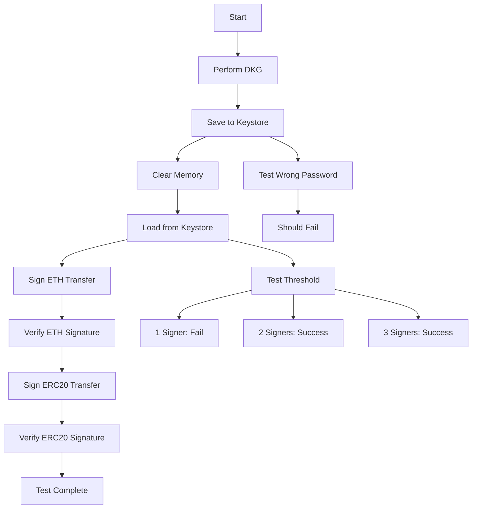

# Keystore End-to-End Test Plan

## Overview

This document outlines the comprehensive E2E test for keystore functionality, including:
- Wallet persistence (save/load)
- Multiple transaction types (ETH, ERC20)
- Signature verification
- Security validation

> **Scope note**: Phases 3–4 below describe **transaction signing**
> (ETH transfer with to/value/gas fields, ERC20 transfer function-
> selector encoding). The TUI as shipped signs **messages**
> (EIP-191 `personal_sign` shape over user-supplied bytes) — it does
> NOT build Ethereum transactions or decode function selectors. See
> `apps/tui-node/docs/guides/USER_GUIDE.md` § Signing Messages →
> Scope and the "Phase C scope: message-only field" comment at
> `src/elm/components/sign_transaction.rs` for the honest picture.
> Treat the transaction-shaped examples below as aspirational test
> targets — the real signature produced by the TUI is over the
> transaction's serialized bytes (you have to serialize the
> transaction externally and hand the bytes to the TUI as a hex
> message). Phase 5 (signature verification) + Phases 1–2 (keystore
> save/load, unlock, decrypt) ARE real and test-covered — those
> phases exercise the shipped keystore path.

## Test Scenarios

### 🔐 Phase 1: Wallet Creation and Persistence

#### 1.1 DKG with Keystore Save
```
Participants: P1 (Coordinator), P2, P3
Threshold: 2-of-3
Curve: secp256k1
```

**Steps:**
1. Perform complete DKG ceremony
2. Encrypt key shares with password (AES-256-GCM + PBKDF2 100k iterations)
3. Save to keystore on each participant:
   - Single file per wallet:
     `~/.frost_keystore/<device_id>/<curve>/<wallet_id>.json`
   - The file wraps plaintext metadata AND the base64-encoded
     encrypted-share blob in one `WalletFile` JSON document —
     there is NO separate `<wallet_id>.dat` sidecar. (Earlier
     drafts of this test plan described a two-file split; that
     split does not exist.)
4. Verify the `.json` file exists and the `data` field inside is
   opaque base64 ciphertext (not readable key material).

#### 1.2 Keystore file layout

Real layout is ONE file per wallet — see
`save_wallet_file_v2_with_method` in
`apps/tui-node/src/keystore/storage.rs:216-247`. The on-disk
format is the `WalletFile` struct defined in
`src/keystore/models.rs:438-453`:

```json
{
  "version": "2.0",
  "encrypted": true,
  "algorithm": "AES-256-GCM-Argon2id",
  "data": "<base64-encoded ciphertext of the FROST key-share blob>",
  "metadata": {
    "session_id": "<wallet identifier, aliased as `wallet_id`>",
    "device_id": "<this node's DKG device_id>",
    "curve_type": "secp256k1",
    "threshold": 2,
    "total_participants": 3,
    "participant_index": 2,
    "group_public_key": "<serialized FROST VerifyingKey hex>",
    "participants": ["alice-laptop", "bob-desktop", "charlie-phone"],
    "created_at": "2025-06-27T12:00:00Z",
    "last_modified": "2025-06-27T12:00:00Z"
  }
}
```

The wrapper fields are `version` / `encrypted` / `algorithm` /
`data` / `metadata`; inside `metadata` sits the serialized
`WalletMetadata` (`src/keystore/models.rs:222-273`). Earlier drafts
of this doc showed the metadata fields hoisted to the top level
of the JSON with a separate `.dat` blob carrying the ciphertext —
that layout never shipped; the real serializer writes everything
as one embedded JSON document. Also earlier drafts used the
deprecated field names (`wallet_id` at top level; `blockchains`
array as primary; `created_at` as a unix-timestamp integer). Real
field semantics:

- `session_id` is the canonical field; `wallet_id` is a
  `#[serde(alias)]` for backward-compat reads only.
- `created_at` + `last_modified` are ISO-8601 strings (type
  `String`), not u64 timestamps.
- `participants: Vec<String>` holds the DKG cohort's device_ids;
  used for cold-start signing reconstruction.
- Legacy `blockchains: Vec<BlockchainInfo>` + `device_name?`
  exist with `#[serde(skip_serializing_if = ...)]` guards so
  fresh writes omit them — they appear only on older on-disk
  wallets. Address derivation uses `group_public_key` + `curve_type`
  directly (see `WalletMetadata::derive_ethereum_address` /
  `derive_solana_address`).

The ciphertext inside `data` decrypts with password + either
PBKDF2-HMAC-SHA256 (`PBKDF2_ITERATIONS = 100_000`, constant at
`src/keystore/encryption.rs:25`) or Argon2id, depending on the
`algorithm` field. Both algorithms use AES-256-GCM underneath. No
Ethereum-keystore-V3 compatibility — this is a bespoke format.

### 🔑 Phase 2: Wallet Loading

#### 2.1 Load from Keystore
**Steps:**
1. Clear all in-memory state
2. Load keystore files
3. Decrypt with password
4. Reconstruct FROST key packages
5. Verify loaded wallet matches original

#### 2.2 Validation Checks
- ✅ Correct participant ID
- ✅ Same group public key
- ✅ Same threshold parameters
- ✅ Can derive same Ethereum address

### 💰 Phase 3: ETH Transfer Signing

#### 3.1 Transaction Creation
```typescript
{
  to: "0x742d35Cc6634C0532925a3b844Bc9e7595f0bEb7",
  value: "1.5 ETH",
  gasPrice: "20 gwei",
  gasLimit: 21000,
  nonce: 42,
  chainId: 1
}
```

#### 3.2 Signing with Loaded Wallet
**Steps:**
1. Load wallets for P1 and P2
2. Create signing session
3. Generate signature shares
4. Aggregate to final signature
5. Verify signature is valid

### 🪙 Phase 4: ERC20 Transfer Signing

#### 4.1 ERC20 Transaction Structure
```typescript
{
  to: "0xA0b86991c6218b36c1d19D4a2e9Eb0cE3606eB48", // USDC Contract
  data: "0xa9059cbb" + // transfer(address,uint256) selector
        "000000000000000000000000742d35cc6634c0532925a3b844bc9e7595f0beb7" + // recipient
        "00000000000000000000000000000000000000000000000000000000000f4240", // amount (1,000,000)
  gasPrice: "30 gwei",
  gasLimit: 65000,
  nonce: 43,
  chainId: 1
}
```

#### 4.2 ERC20-Specific Validation
- ✅ Correct function selector (0xa9059cbb for transfer)
- ✅ Proper parameter encoding
- ✅ Valid signature for contract interaction
- ✅ Gas estimation appropriate for ERC20

### 🔍 Phase 5: Signature Verification

#### 5.1 Verification Methods
1. **FROST Verification**: Verify against group public key
2. **Ethereum Recovery**: Attempt ecrecover (with format conversion)
3. **Transaction Hash**: Verify correct message was signed

#### 5.2 Security Assertions
- ❌ Cannot sign with only 1 participant (below threshold)
- ❌ Cannot load keystore with wrong password (PBKDF2 / Argon2id
  key derivation + GCM auth-tag mismatch rejects decryption)
- ❌ Cannot modify keystore without detection (AES-256-GCM auth
  tag fails on mutated ciphertext)
- ✅ Can sign with any valid t-of-n subset (e.g. any 2 of 3)
- ✅ Every signature verifies against the group public key via
  `frost-core::VerifyingKey::verify`

Earlier drafts of the last bullet claimed "All signatures are
deterministic for same message" — that's **wrong** for FROST.
Each signing ceremony generates fresh hiding + binding nonces
(`SigningNonces::new`), so signing the same message twice
produces different signature bytes. Both will verify against the
same group public key (that's the guarantee), but the bytes
themselves are NOT reproducible. This is a deliberate FROST
design property — deterministic signatures leak secret-share
information under certain adversary models.

## Test Workflow



## Implementation Files

What actually ships under `apps/tui-node/src/`:

| Claimed | Real |
|---|---|
| `keystore_manager.rs` | `src/keystore/storage.rs` (Keystore struct) + `src/keystore/encryption.rs` (AES-256-GCM + PBKDF2) |
| `erc20_encoder.rs` | `src/utils/erc20_encoder.rs` ✓ |
| `keystore_e2e_test.rs` | Not present as a single-file E2E — coverage is split across `tests/` + component unit tests |
| `signature_verifier.rs` | Not a separate module; verification goes through `frost-core`'s `VerifyingKey::verify` (already run inside `aggregate`) plus `src/utils/eth_helper.rs` for the Ethereum ecrecover conversion path (EIP-191 signing lands as part of Phase D.1 — 31 eip/ecrecover hits across 5 files confirm this surface exists) |

### Test Data
- Standard ERC20 transfer payloads (see `src/utils/erc20_encoder.rs` tests)
- Throwaway passwords for encryption tests
- Known-answer test vectors for the verification paths

## Success Criteria

1. **Persistence**: Wallet survives application restart
2. **Security**: Encrypted storage with strong KDF
3. **Compatibility**: Works with standard Ethereum tools
4. **Flexibility**: Can sign multiple transaction types
5. **Reliability**: Deterministic signatures
6. **Threshold**: Proper t-of-n security model

## Error Scenarios to Test

1. Wrong password on load
2. Corrupted keystore file
3. Missing participant for threshold
4. Invalid transaction data
5. Wrong chain ID
6. Insufficient gas
7. Malformed ERC20 data

## Expected Outputs

### Successful Test Run
```
✅ DKG completed - 3 participants
✅ Keystores saved - 3 files created
✅ Memory cleared - State reset
✅ Keystores loaded - 3 wallets restored
✅ ETH transfer signed - 2-of-3 threshold
✅ ETH signature verified
✅ ERC20 transfer signed - 2-of-3 threshold
✅ ERC20 signature verified
✅ Wrong password rejected
✅ Single signer rejected (below threshold)
✅ All security checks passed

Test Summary: 11/11 passed
```

## Notes

- Use deterministic test vectors where possible
- Ensure cleanup of test keystore files
- Test both online and offline signing flows
- Validate against real Ethereum contracts on testnet if possible